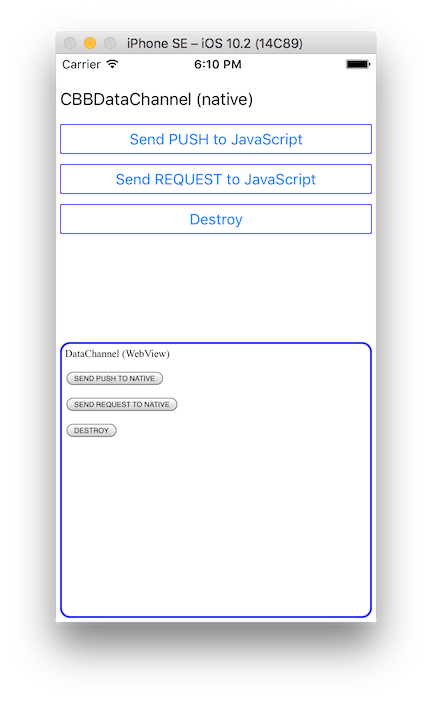

# <p align="center"></p>
DataChannel の iOS用の実装を提供します。

## Example 
本リポジトリの [Example](Example) ディレクトリが, WKWebView(HTML) と ネイティブコード(Objective-c) 間の DataChannel で通信をする簡単なサンプル・プロジェクトになっています。
- Objective-c: [ViewController.m](Example/Example/ViewController.m)
- HTML: [index.html](Example/www/index.html), [script.js](Example/www/script.js), [data-channel.js](Example/www/data-channel.js)



Exampleをビルドして動作させる場合, 事前に `pod install` を実行してください。
```
cd Example
pod install
open Example.xcworkspace
```

## Setup 
### Podspec
```
abstract_target 'defaults' do
    pod 'CBBDataChannel', '2.0.2'
end
```

## Usage
#### step 1: CBBDataChannelの準備
使用するCBBDataBusインスタンスを指定してCBBDataChannelを生成します。

```objective-c
    CBBDataChannel* dataChannel = [[CBBDataChannel alloc] initWithDataBus:dataBus];
```

#### step 2: 受信データの受け口を設定
- `CBBDataChannel#addHandler` で受信データの受け口となるハンドラを追加します
- REQUESTを受信した場合は `callback` が設定されているため, それを呼び出して応答を返信する必要があります

```objective-c
    [dataChannel addHandler:^(id  _Nullable packet, CBBDataChannelResponseCallback  _Nullable callback) {
        if (callback) {
            // REQUEST (双方向データ) を受信時の処理
            // 最後に処理結果を応答する必要がある
            callback(@"response-data");
        } else {
            // PUSH (単方向データ) を受信時の処理
        }
    }];
```

> 追加したハンドラは `CBBDataChannel#removeHandler` または `CBBDataChannel#removeAllHandlers` で削除することができます。

#### step 3-1: PUSH (単方向データ) を送信
`CBBDataChannel#sendPush` でPUSH (単方向データ) を送信することができます

```objective-c
    [dataChannel sendPush:@["push-data"]];
```

#### step 3-2: REQUEST (双方向データ) を送信
`CBBDataChannel#sendRequest` でREQUEST (双方向データ) を送信することができます

```objective-c
    [dataChannel sendRequest:@["request-data"] callback:^(NSError * _Nullable error, id  _Nullable packet) {
        // 応答を受信時の処理
    }];
```

#### step 4: 破棄
`CBBDataChannel#destroy` で破棄できます。

```objectChannel
    [dataChannel destroy];
```

> DataChannelをdestroyしても下位層（DataBus）のdestroyは行われません。

## License
- Source code, Documents: [MIT](LICENSE)
- Image files: [CC BY 2.1 JP](https://creativecommons.org/licenses/by/2.1/jp/)
